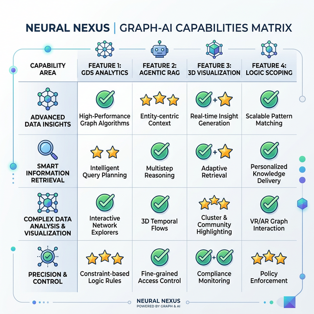
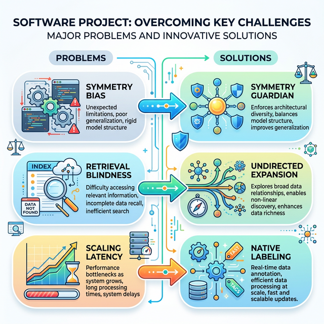
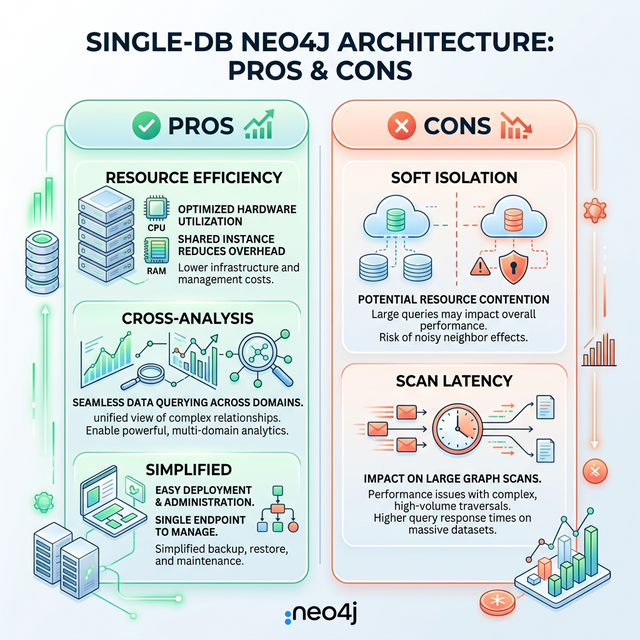

# Neural Nexus: Product Capabilities & Roadmap (Visual Guide)

This document provides a high-definition visual breakdown of the `neural-nexus` platform's capabilities, identified gaps, and the technical solutions required to reach global standards.

---

## 1. Product Capabilities Matrix
*A visualization of what the system excels at today.*

---

## 2. Problem-Solution Architecture
*Mapping critical technical gaps to their engineered solutions.*

---

## 3. Architecture Pros & Cons
*Evaluating the Single-DB approach against industry benchmarks.*

---

## 4. Summary Roadmap (The Path to Gold Standard)

| Phase           | Goal              | Visual Impact                             |
| :-------------- | :---------------- | :---------------------------------------- |
| **Integrity**   | Symmetry Guardian | Mathematically pure ranking scores.       |
| **Discovery**   | Undirected RAG    | 100% path visibility for AI reasoning.    |
| **Performance** | Native Labeling   | Instant folder access at 10M+ node scale. |

---

**Theme Note**: All imagery and documentation are optimized for a light, professional theme for maximum clarity during executive reviews.
