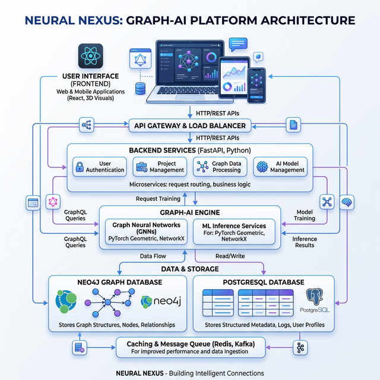
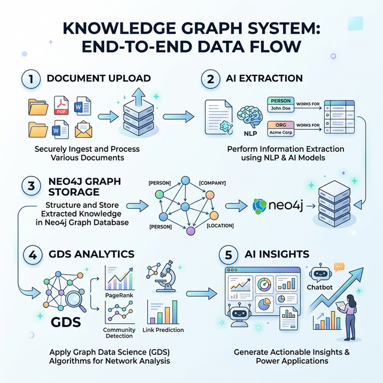
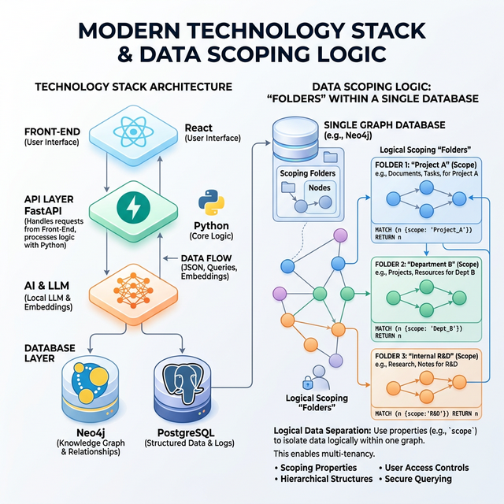
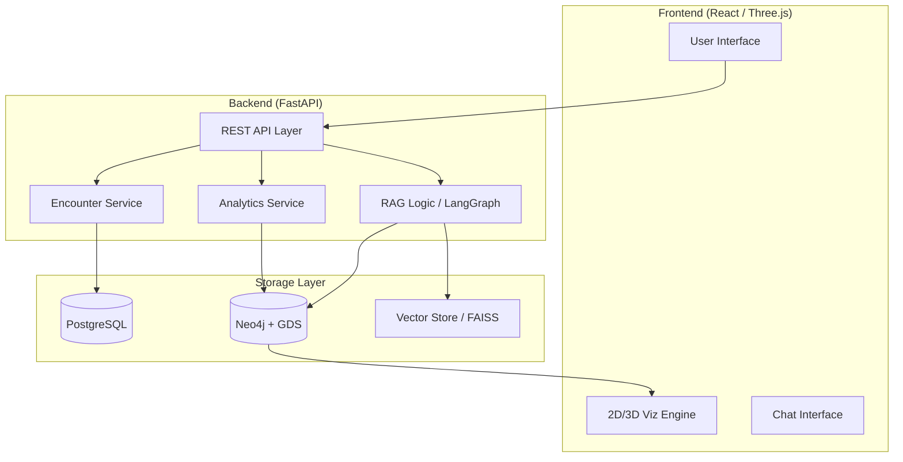
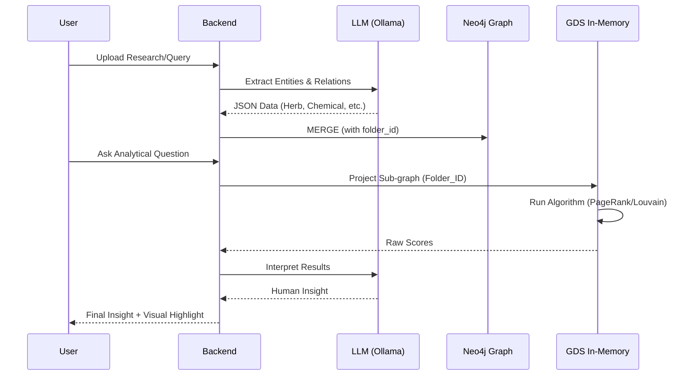

# Neural Nexus: System Architecture & Data Flow Infographics

This document provides a high-definition detailed breakdown of the `neural-nexus` product architecture, data flow, and technology stack.

---

## 1. High-Definition Visual Blueprint (Light Theme)

Below is a carousel of professional architectural infographics for the platform.

````carousel

<!-- slide -->

<!-- slide -->

````

---

## 2. Technical Diagrams (Mermaid)

### 2.1 High-Level Architecture


### 2.2 End-to-End Logic Flow


---

## 3. Technology Stack Breakdown
*The "Nexus Master Engine" Components.*

| Category               | Component              | Usage in Neural Nexus                                      |
| :--------------------- | :--------------------- | :--------------------------------------------------------- |
| **Logic**              | **FastAPI / Python**   | Core API handling and business logic threading.            |
| **Graph Intelligence** | **Neo4j / GDS**        | Storage of relationships and execution of math algorithms. |
| **Relational Storage** | **PostgreSQL**         | Metadata, session handling, and folder registries.         |
| **AI Brain**           | **LangGraph / Ollama** | State-managed agentic RAG for local reasoning.             |
| **Visual Core**        | **React-Three-Fiber**  | Immersive 3D structural visualization.                     |
| **Communication**      | **Redis / WebSockets** | Real-time updates and high-speed data caching.             |

---

**Theme Note**: This documentation and related images are optimized for light-mode viewing to ensure maximum clarity and professionalism.
